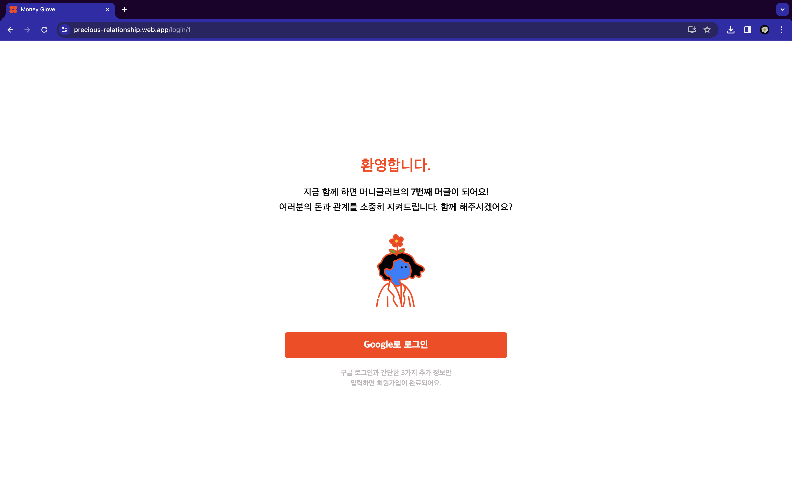
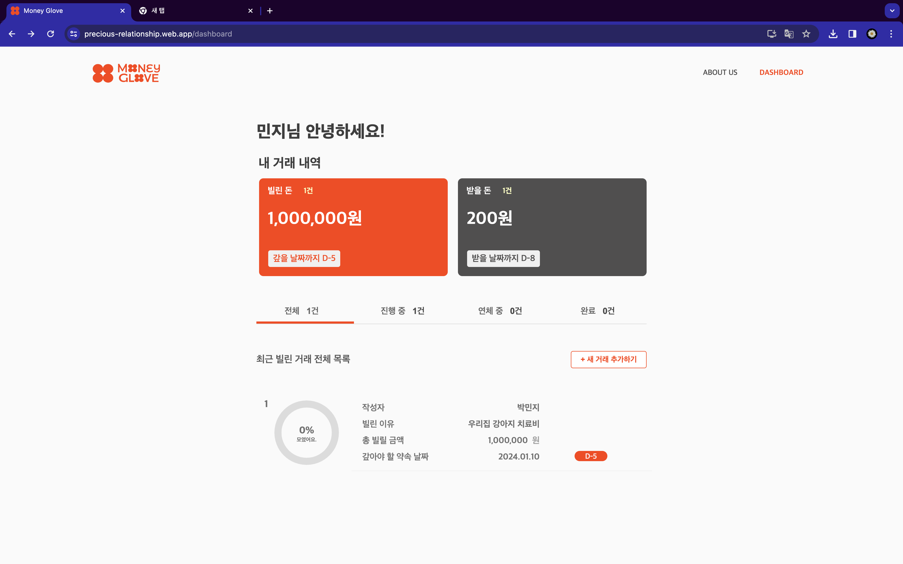
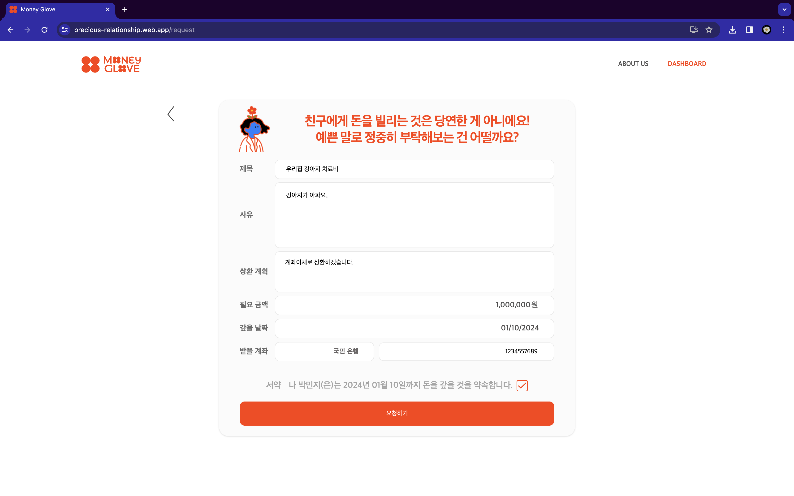
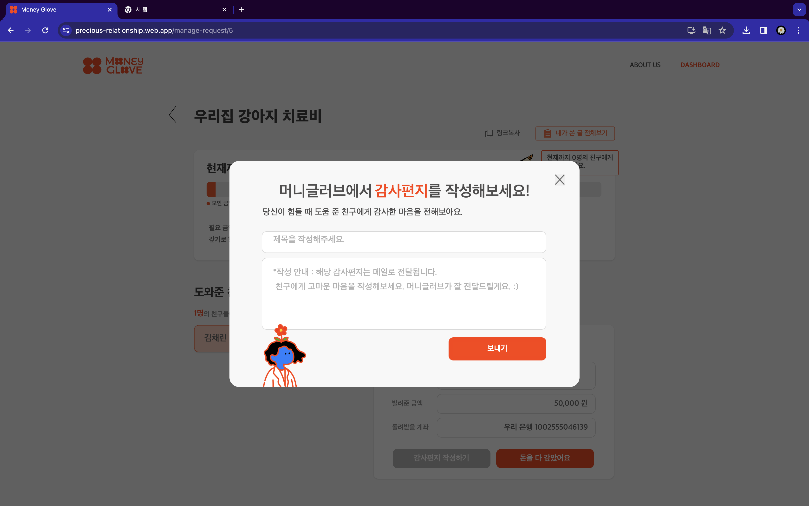
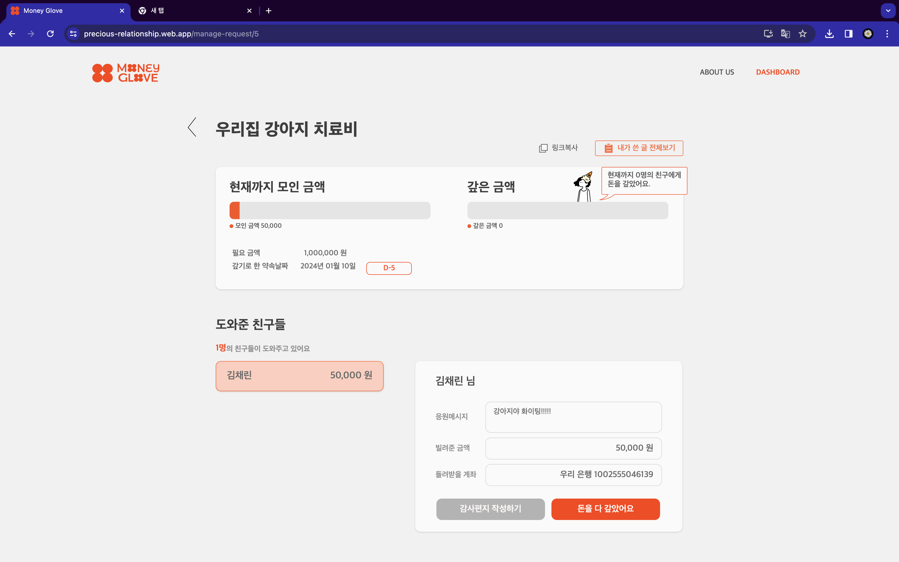

  

## 📺 프로젝트 소개
#### "친구 간의 채무관계는 돈도 잃고 우정도 잃는다? MoneyGlove를 통해 돈도 지키고 우정도 지키자!"
 
MoneyGlove는 크라우드 펀딩 형식을 통해 친구 간의 1:n 채무 관계를 채결·관리하고, 알람 기능을 통해 채권자와 채무자 사이의 상황을 쉽게 공유하여 채무관계에서 일어나는 불편함을 간편하게 해결할 수 있는 서비스입니다.   
  

+ 채무자는 글을 작성하여 링크를 통해 친구들에게 작성한 글을 공유하고, 기록된 채무기록을 관리할 수 있습니다.
+ 채권자는 공유받은 링크를 통해 글을 확인하고 채무기록을 남길 수 있습니다.
+ 구글 이메일을 통해 채권자와 채무자는 채무 기록에 대한 알람을 받을 수 있습니다.

## 🔎 목차
1. [프로젝트 전체 기간](#-프로젝트-전체-기간)
2. [팀원 구성](#-팀원-구성)
3. [Stack](#-stack)
4. [페이지별 기능](#-페이지별-기능)
5. [라이브러리](#-라이브러리)
6. [설치 방법](#-설치-방법)

## 📆 [프로젝트 전체 기간](#-프로젝트-전체-기간)
+ 23.12.02 ~24.01.06

# [🔥My Precious Web Repository🔥](https://github.com/Club-PARD/My_Precious_WEB)
- front repository 

## 👨‍👩‍👧‍👦 [팀원 구성](#-팀원-구성)

[팀 값진연고](https://dongwon0507.notion.site/2579c73b82614450ad676fe12f491ec9?pvs=4, "값진 연고 노션페이지")

|역할|                        WEB                        |                                 WEB                                 |               WEB                |                  SERVER                  |                                                                                                                                             PM                                                                                                                                              |DESIGN|
|:------:|:-------------------------------------------------:|:-------------------------------------------------------------------:|:--------------------------------:|:----------------------------------------:|:-------------------------------------------------------------------------------------------------------------------------------------------------------------------------------------------------------------------------------------------------------------------------------------------:|:---:|
|**프로필**|                                 | | | | ||
|**이름**|        [김현중](https://github.com/hjkim0905)        |                [박민지](https://github.com/minzziPark)                 | [이유현](https://github.com/LYH513) | [김채린](https://github.com/seizethedaylyn) |                                                                                                                                             장동원                                                                                                                                             |김현지|
|**나이**|                        26                         |                                 25                                  |                23                |                    24                    |                                                                                                                                             23                                                                                                                                              |25|

## ✅ [Stack](#-stack)
### 프론트엔드

### 백엔드

## 📄 [페이지별 기능](#-페이지별-기능)

### [onboarding]

### [login]

### [user join]
- 회원가입을 통해 이름, 생년월일, 전화번호를 입력받습니다.
    - 생년월일을 입력할 때 숫자만 입력 가능하고, 년은 4글자 이하, 월,일은 2글자 이하로만 입력이 가능하도록 하였습니다.
    - 전화번호를 입력할 때 숫자와 -만 입력이 가능하고, 숫자를 입력할 때 자동으로 -가 생깁니다.
    - 전화번호 입력 후 인증번호 받기를 누르면 인증문자가 해당 번호로 전송됩니다. 인승이 성공할 경우에만 다음 단계로 이동하며, 실패한 경우 모달을 통해 재인증 안내를 진행합니다.

### [dashboard]

### [board write]

  
### [letter]

### [board]

  
## 📥 [라이브러리](#-라이브러리)
- npm install react-router-dom
- npm install styled-components
- npm install axios
- npm i react-checkmark
- npm install react-transition-group
- npm install --save rc-progress
- npm install @mui/lab @mui/material
- npm i react-modal
- npm i recoil

## 🖥️

