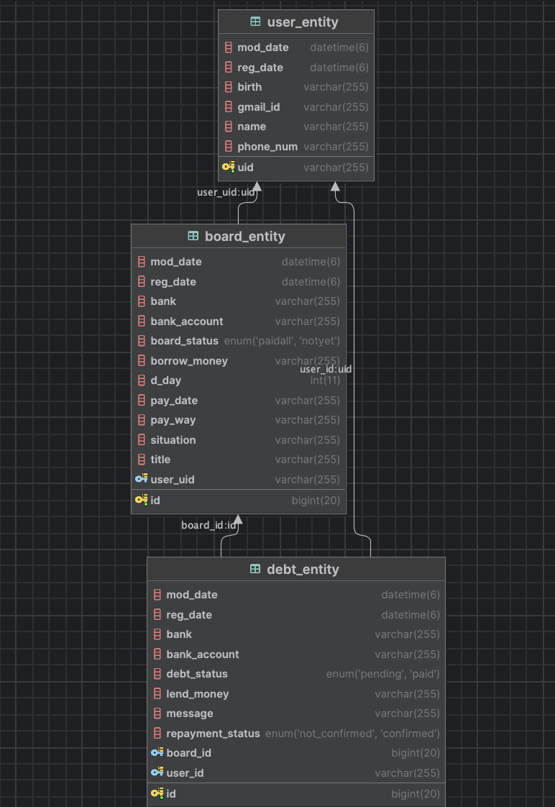
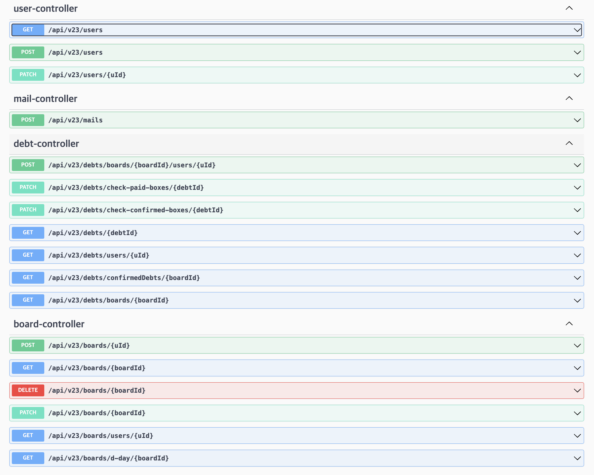

  

## 📺 프로젝트 소개
#### "친구 간의 채무관계는 돈도 잃고 우정도 잃는다? MoneyGlove를 통해 돈도 지키고 우정도 지키자!"
 
MoneyGlove는 크라우드 펀딩 형식을 통해 친구 간의 1:n 채무 관계를 채결·관리하고, 알람 기능을 통해 채권자와 채무자 사이의 상황을 쉽게 공유하여 채무관계에서 일어나는 불편함을 간편하게 해결할 수 있는 서비스입니다.   
  

+ 채무자는 글을 작성하여 링크를 통해 친구들에게 작성한 글을 공유하고, 기록된 채무기록을 관리할 수 있습니다.
+ 채권자는 공유받은 링크를 통해 글을 확인하고 채무기록을 남길 수 있습니다.
+ 구글 이메일을 통해 채권자와 채무자는 채무 기록에 대한 알람을 받을 수 있습니다.

## 🔎 목차
1. [프로젝트 전체 기간](#-프로젝트-전체-기간)
2. [팀원 구성](#-팀원-구성)
3. [Stack](#-stack)
4. [페이지별 기능](#-페이지별-기능)
5. [라이브러리](#-라이브러리)
6. [설치 방법](#-설치-방법)

## 📆 [프로젝트 전체 기간](#-프로젝트-전체-기간)
+ 23.12.02 ~24.01.06

## 👨‍👩‍👧‍👦 [팀원 구성](#-팀원-구성)

[팀 값진연고](https://dongwon0507.notion.site/2579c73b82614450ad676fe12f491ec9?pvs=4, "값진 연고 노션페이지")

|역할|                        WEB                        |                                 WEB                                 |               WEB                |                  SERVER                  |                                                                                                                                             PM                                                                                                                                              |DESIGN|
|:------:|:-------------------------------------------------:|:-------------------------------------------------------------------:|:--------------------------------:|:----------------------------------------:|:-------------------------------------------------------------------------------------------------------------------------------------------------------------------------------------------------------------------------------------------------------------------------------------------:|:---:|
|**프로필**|                                 | | | | ||
|**이름**|        [김현중](https://github.com/hjkim0905)        |                [박민지](https://github.com/minzziPark)                 | [이유현](https://github.com/LYH513) | [김채린](https://github.com/seizethedaylyn) |                                                                                                                                             장동원                                                                                                                                             |김현지|
|**나이**|                        26                         |                                 25                                  |                23                |                    24                    |                                                                                                                                             23                                                                                                                                              |25|

## ✅ [Stack](#-stack)
### 프론트엔드

### 백엔드

## 📄 [페이지별 기능](#-페이지별-기능)

### [온보딩]

### [로그인]
- 구글 로그인을 통해 로그인을 진행합니다.
    - 회원가입을 한 적 있는 경우 : 구글 로그인이 성공하면 데시보드(홈 화면)로 이동합니다.
    - 회원가입을 한 적 없는 경우 : 회원가입을 진행합니다.

### [회원가입]
- 회원가입을 통해 이름, 생년월일, 전화번호를 입력받습니다.
    - 생년월일을 입력할 때 숫자만 입력 가능하고, 년은 4글자 이하, 월,일은 2글자 이하로만 입력이 가능하도록 하였습니다.
    - 전화번호를 입력할 때 숫자와 -만 입력이 가능하고, 숫자를 입력할 때 자동으로 -가 생깁니다.
    - 전화번호 입력 후 인증번호 받기를 누르면 인증문자가 해당 번호로 전송됩니다. 인승이 성공할 경우에만 다음 단계로 이동하며, 실패한 경우 모달을 통해 재인증 안내를 진행합니다.

### [데시보드]
- 내 거래 내역을 보여줍니다.
    - **빌린 돈**: 새 거래 추가하기를 통해 추가한 거래들의 건수, 총 빌린 금액, 빌린 거래 목록 중 갚아야할 가장 가까운 날짜를 D-Day로 보여줍니다.
    - **받을 돈**: 링크를 통해 공유받을 글에서 돈을 빌려줬다는 메시지를 남길 경우 추가됩니다. 빌려준 거래들의 건수, 총 빌려준 금액, 빌려준 거래 목록 중 받아야할 가장 가까운 날짜를 D-Day로 보여줍니다.
- 내 거래 내역에서 빌린 돈을 클릭할 경우:
    - 최근 빌린 거래 전체 목록에서 새 거래 추가하기를 통해 추가한 전체 거래들을 보여줍니다.
    - 원형 프로그레스바를 통해 빌리고 싶은 금액 중 받은 돈을 시각적으로 보여주며, 빌린 이유와 총 빌릴 금액, 갚아야할 약속 날짜를 보여줍니다.
    - 최근에 빌린 거래 전체 목록에서 거래를 클릭할 시 해당 거래에 대한 글 관리 페이지로 이동합니다.
- 내 거래 내역에서 받을 돈을 클릭한 경우:
    - 링크를 통해 공유받은 글에서 돈을 빌려줬다는 메시지를 작성한 전체 거래들을 보여줍니다.
    - 원형 프로그레스바를 통해 채무자가 빌리고 싶다고 설정한 금액 중 모인 돈을 시각적으로 보여주며, 채무자의 빌린 이유와 총 빌릴 금액, 갚아야할 약속 날짜를 보여줍니다.
    - 최근에 빌려준 거래 전체 목록에서 거래를 클릭할 시 해당 거래에 대한 글 읽기 페이지로 이동합니다.

### [글쓰기 페이지]
- 새 거래 추가하기를 클릭할 경우 해당 페이지로 이동합니다.
- 제목, 사유, 상환계획, 필요금액, 갚을 날짜, 받을 계좌(은행명, 은행계좌)를 입력받습니다.
    - 모든 입력칸에 입력하지 않은 경우 요청하기 버튼이 비활성화되어 글 게시가 불가능합니다.
    - 필요금액과 계좌의 경우 숫자만 입력이 가능하며, 필요금액을 입력할시 자동으로 세 자리마다 반점을 추가합니다.
    - 요청하기 버튼을 누르면 작성 완료 후 수정이 불가능하다는 안내메시지가 띄워지고 작성완료를 누르면 글 작성이 끝이 납니다.
    - 해당 거래는 데시보드에서 확인이 가능합니다.
  
### [글 읽기 페이지]
#### 채권자가 링크를 받았을 때
- 링크를 통해 공유받은 글을 볼 수 있습니다.
- '나도 도울게요' 버튼을 누를 시
    - 로그인을 한 경우: 송금한 이후 빌려준 거래내역을 남길 수 있는 메시지를 작성할 수 있습니다.
        - 응원메시지, 빌려준 금액, 돌려받을 계좌를 입력하며, 저장하기 버튼을 누를시 해당 거래의 채무자의 구글 이메일로 메일이 전송됩니다.
        - 저장하기 버튼을 누르면 데시보드 페이지로 이동하여 받을 돈에서 빌려준 거래 내역을 확인할 수 있습니다.
        - 재촉편지를 작성할 수 있으며, 작성한 재촉편지는 해당 거래의 채무자의 구글 이메일로 전송됩니다.
        - 갚은 것을 확인했어요 버튼을 누르면 채무자에게 메일이 전송되고 해당 거래에 대한 채무관계가 완료됩니다.
    - 로그인을 하지 않은 경우: 로그인 페이지로 이동하여 로그인을 진행하도록 합니다.

### [글관리 페이지]
#### 채무자
- 데시보드에서 최근 빌린 거래 전체 목록 중 거래를 클릭할 시 글관리 페이지로 이동합니다.
- 글 관리 페이지는 클릭한 거래에 대한 요약된 정보를 보여줍니다.
    - 상단에 현재까지 모인 금액과 갚은 금액에 대한 수치, 필요금액, 갚기로 한 약속 날짜, D-Day, 현재까지 갚은 친구의 수
    - 링크 복사를 클릭하면 해당 거래에 대한 링크를 복사할 수 있으며, 링크로 들어갈 시 해당 거래에 대한 글 읽기 패이지로 이동합니다.
    - 글 전체보기를 클릭할 시 새 거래추가하기를 통해 작성한 모든 내용을 확인할 수 있습니다.
- 하단에는 해당 거래에 돈을 빌려줬다는 거래 내역을 남긴 채권자들의 목록을 보여줍니다.
    - 채권자가 돈을 빌려준 거래 내역이 없을 경우 아직 내역이 없다고 보여줍니다.
    - 채권자가 돈을 빌려준 거래 내역이 있을 경우 빌려준 채권자의 이름과 금액을 보여줍니다.
        - 해당 채권자의 거래 내역을 클릭할 시 채권자의 이름, 채권자가 작성한 응원메시지, 빌려준 금액, 돌려받을 계좌를 확인할 수 있습니다.
        - 감사편지 작성하기를 통해 감사편지를 작성할 수 있으며, 해당 감사편지는 채권자의 구글 이메일로 전송됩니다.
        - 돈을 다 갚았어요 버튼을 누르면 채권자의 구글 이메일로 메일이 전송됩니다.
  
## 📥 [라이브러리](#-라이브러리)
- npm install react-router-dom
- npm install styled-components
- npm install axios
- npm i react-checkmark
- npm install react-transition-group
- npm install --save rc-progress
- npm install @mui/lab @mui/material
- npm i react-modal
- npm i recoil

## 🖥️

